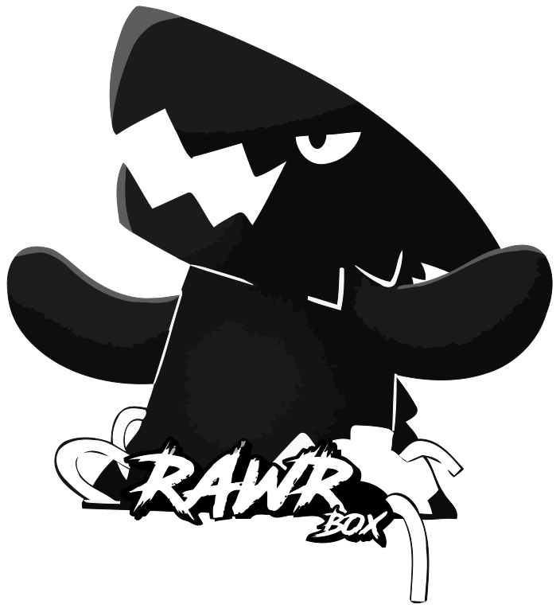
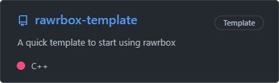

<h2>
	

		 
		<a href="https://github.com/edunad/rawrbox">RawrBox</a> - PSX..ish game engine
	

</h2>
<h4>
	

		&nbsp;
		&nbsp;
		&nbsp;
		&nbsp;
		
		  
		<a href="#features">Features</a> -
		<a href="#libs">Libs</a> -
		<a href="#building">Building</a> -
		<a href="#samples">Samples</a>
	

</h4>

	 

# FEATURES

- Model loading (animations, light, texture, blend shapes) using [assimp](https://github.com/assimp/assimp)
- Light support (point, spot, directional)
- Support for rendering plugins (like clustered rendering, post processing, etc)
- 3D text
- Bindless rendering
- 2D stencil drawing
- Fonts (ttf) using [stb](https://github.com/nothings/stb)
- JSON loading using [glaze](https://github.com/stephenberry/glaze)
- Images loading (png, jpeg, tga, bitmap, gif) using [stb](https://github.com/nothings/stb), SVG using [lunasvg](https://github.com/sammycage/lunasvg), WEBP using [libwebp](https://github.com/webmproject/libwebp)
- Video only using [webm](https://github.com/webmproject/libwebm)
- Sounds using [BASS](https://www.un4seen.com/) lib
- Custom UI support
- Material system (similar to unity)
- Vulkan / DirectX / OpenGL support using [Diligent](https://github.com/DiligentGraphics/DiligentCore)
- Linux Wayland support + steam deck support
- 3D Physics system using [JoltPhysics](https://github.com/jrouwe/JoltPhysics)
- 2D Physics system using [Muli](https://github.com/Sopiro/Muli)
- Decal system
- Instancing support
- Scripting / modding support with LUA using [luabridge3](https://github.com/kunitoki/LuaBridge3) and [luau](https://github.com/luau-lang/luau)
- Post-processing effects support
- HTTP / HTTPS requests using curl + [libcpr](https://github.com/libcpr/cpr)
- Packet networking support
- Custom dev console (with support for custom commands)
- I18N (internationalization) support
- GPU picking

# TODO LIST

- Particle engine
- Add animation blending
- Add lights shadow maps

# LIBS

| LIB                  | DESCRIPTION                                        | USAGE                                                                                      |      DEPENDENCIES      |
| :------------------- | :------------------------------------------------- | :----------------------------------------------------------------------------------------- | :--------------------: |
| `RAWRBOX.RENDER`     | Rendering lib (aka, contains window, stencil, etc) | Contains window, stencil, model / texture loading. Basically anything related to rendering |   `ENGINE` & `MATH`    |
| `RAWRBOX.MATH`       | Math lib                                           | Contains vector, color and other math related classes                                      |                        |
| `RAWRBOX.BASS`       | Bass lib (aka sound loading)                       | Loads sounds using the BASS lib, supports 3D & http sound streaming                        |   `ENGINE` & `MATH`    |
| `RAWRBOX.UTILS`      | Utils lib                                          | Utils for game development                                                                 |                        |
| `RAWRBOX.ENGINE`     | Engine lib (aka game loop)                         | The engine it self, contains the game loop mechanism                                       |        `UTILS`         |
| `RAWRBOX.UI`         | UI lib                                             | UI components lib                                                                          | `RENDER` & `RESOURCES` |
| `RAWRBOX.RESOURCES`  | Resources manager lib                              | Resource manager. Handles loading and stores the pointers for easy access                  |        `UTILS`         |
| `RAWRBOX.PHYSICS.3D` | 3D Physics lib                                     | Handles 3D physics                                                                         |   `ENGINE` & `MATH`    |
| `RAWRBOX.PHYSICS.2D` | 2D Physics lib                                     | Handles 2D physics                                                                         |   `ENGINE` & `MATH`    |
| `RAWRBOX.ASSIMP`     | Assimp lib                                         | Handles assimp model loading                                                               | `RENDER` & `RESOURCES` |
| `RAWRBOX.WEBM`       | WEBM lib                                           | Handles webm loading                                                                       | `RENDER` & `RESOURCES` |
| `RAWRBOX.SCRIPTING`  | Scripting lib                                      | Handles lua & mod loading                                                                  |   `ENGINE` & `MATH`    |
| `RAWRBOX.NETWORK`    | Networking lib                                     | Handles networking                                                                         |                        |

  

# CMAKE OPTIONS

| OPTION NAME                                | NOTE                                                                                               |
| :----------------------------------------- | :------------------------------------------------------------------------------------------------- |
| `RAWRBOX_BUILD_TESTING`                    | Builds & enables project tests                                                                     |
| `RAWRBOX_BUILD_SAMPLES`                    | Builds the project sample                                                                          |
| --                                         | --                                                                                                 |
| `RAWRBOX_CONTENT_FOLDER`                   | The content folder to output assets. Default is `assets`                                           |
| --                                         | --                                                                                                 |
| `RAWRBOX_USE_WAYLAND`                      | Enables WAYLAND compiling on LINUX                                                                 |
| --                                         | --                                                                                                 |
| `RAWRBOX_BUILD_RAWRBOX_UI`                 | Builds and includes ui                                                                             |
| `RAWRBOX_BUILD_RAWRBOX_RESOURCES`          | Builds and resouces manager (aka handling and storing loaded resources)                            |
| `RAWRBOX_BUILD_RAWRBOX_3D_PHYSICS`         | Builds the 3D physics engine                                                                       |
| `RAWRBOX_BUILD_RAWRBOX_2D_PHYSICS`         | Builds the 2D physics engine                                                                       |
| `RAWRBOX_BUILD_RAWRBOX_BASS`               | Enables BASS support. ⚠️ [BASS IS ONLY FREE FOR OPEN SOURCE PROJECTS](https://www.un4seen.com/) ⚠️ |
| `RAWRBOX_BUILD_RAWRBOX_ASSIMP`             | Enables assimp model loading                                                                       |
| `RAWRBOX_BUILD_RAWRBOX_WEBM`               | Enables WEBM loading                                                                               |
| `RAWRBOX_BUILD_RAWRBOX_NETWORK`            | Builds network support                                                                             |
| `RAWRBOX_BUILD_RAWRBOX_SCRIPTING`          | Enables lua & modding support                                                                      |
| `RAWRBOX_BUILD_RAWRBOX_SCRIPTING_UNSAFE`   | Enables io support on lua (loading and saving files on the data folder)                            |
| `RAWRBOX_BUILD_QHULL`                      | Builds QHull util                                                                                  |
| --                                         | --                                                                                                 |
| `RAWRBOX_BUILD_MSVC_MULTITHREADED_RUNTIME` | Builds libraries with MSVC Multithreaded runtime (Auto-enabled if jolt is used)                    |
| --                                         | --                                                                                                 |
| `RAWRBOX_DISABLE_SUPPORT_DX12`             | Disable dx12 support                                                                               |
| `RAWRBOX_DISABLE_SUPPORT_VULKAN`           | Disable vulkan support                                                                             |
| --                                         | --                                                                                                 |
| `RAWRBOX_DEV_MODE`                         | Enables all the modules, used for rawrbox development                                              |

  

# INTERNAL DEPENDENCIES

  

  

   

# EXTERNAL DEPENDENCIES

| LIB               | NOTE                                                |
| :---------------- | :-------------------------------------------------- |
| DiligentCore      | Used for vulkan / directx rendering                 |
| glfw              | Used for window management                          |
| --                | --                                                  |
| glaze             | Used for JSON loading                               |
| fmt               | Used for text formatting                            |
| utfcpp            | Used for utf support                                |
| --                | --                                                  |
| stb_image.h       | Used for loading images (png,gif,jpeg)              |
| stb_image_write.h | Used for writting images                            |
| stb_freetype.h    | Used for loading fonts                              |
| stb_easy_font.h   | Used for drawing debug text                         |
| --                | --                                                  |
| thread-pool       | Used for managing async threading                   |
| qhull             | Used for calculating convex hulls from given points |
| assimp            | Used for loading models                             |
| catch2            | Used for testing                                    |
| bass              | Used for loading sounds                             |
| JoltPhysics       | Used for managing 3D physics                        |
| muli              | Used for managing 2D physics                        |
| --                | --                                                  |
| webmlib & vpx     | Used for loading webm                               |
| libwebp           | Used for WEBP loading                               |
| --                | --                                                  |
| luabridge + luau  | Used for loading & managing lua scripting           |
| curl + libcpr     | Used for HTTP / HTTPS requests                      |
| lunasvg           | Used for SVG loading                                |
| cpptrace          | Used for easy error tracing                         |

# BUILDING

## WINDOWS

### REQUIRED SOFTWARE

- [GIT](https://git-scm.com/) or something similar to GIT
- [CMAKE](https://cmake.org/download/) at least > 3.16.3
- Download and install **C++ Build Tools** (2022 is recommended) 
  - 
- Download and install a IDE, [Visual Code](https://code.visualstudio.com/) is **recommended**.
- Download and setup [ninja](https://github.com/ninja-build/ninja/releases) (make sure it's in the enviroment path) 
  - `pip install ninja` if you have python3 installed

### IDE SETUP (Visual Code)

- Open the workspace file (`.code-workspace`) and install the recommended extensions (at least **C++** & **CMAKE**)
- Run **cmake configure**
- Select `[Visual Studio Build Tools <version> Release - amd64]` on the kit popup (for all of the projects)
- Run the compiler by hitting F5

## LINUX

### REQUIRED SOFTWARE

- [PODMAN](https://podman.io/)

### IDE SETUP

- TODO

# SAMPLES

|   001-stencil    | 002-generated-models  |      003-light        |
| :-----------------------------------------------------------------------------------------------------------------: | :-----------------------------------------------------------------------------------------------------------------------------: | :--------------------------------------------------------------------------------------------------------------------: |
| 004-instancing  |     005-post-process      |      006-decals        |
|                                           ~~007-particle-system~~ (TODO)                                            |               008-ui                |      009-assimp        |
| 010-bass-audio   |      011-physics-3D        |  012-physics-2D   |
|      013-webm        |       014-scripting         | 015-gpu-picking  |
